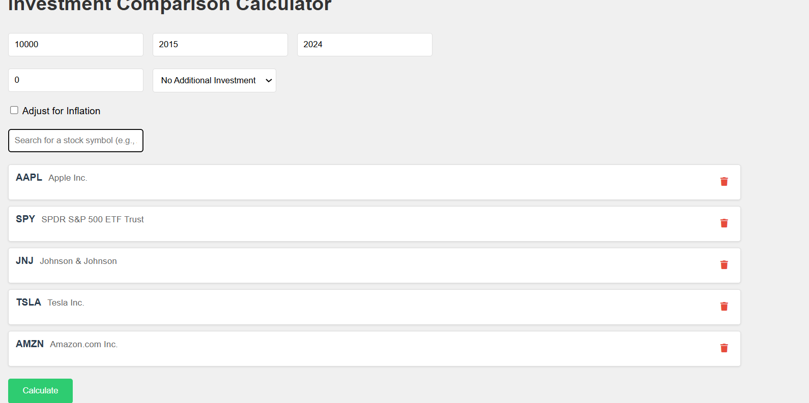
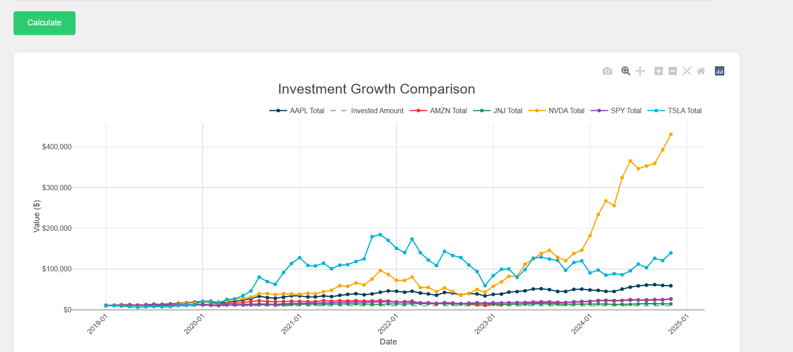

# Investment Portfolio Calculator

## Overview
A sophisticated web application that enables users to simulate and compare investment growth across multiple stocks over time. Built with Flask and modern JavaScript, this tool helps investors understand potential returns through interactive visualizations and detailed analytics.

## Demo :
<p align="center">
  
</p>
<p align="center">
  
</p>

<!-- ## Demo Video
Watch a quick demonstration of the Investment Calculator in action:

<p align="center">
  <a href="docs/videos/demo.mp4">
    
  </a>
</p> -->

<!-- <p align="center">
  
</p> -->

## Key Features
- **Multi-Stock Comparison**: Compare performance of multiple stocks simultaneously
- **Flexible Investment Options**:
  - One-time initial investment
  - Periodic investments (monthly/annual)
  - Customizable date ranges
- **Advanced Analytics**:
  - Real-time stock data integration via Yahoo Finance API
  - Inflation-adjusted calculations
  - Interactive visualizations using Plotly
  - Detailed performance metrics and statistics
- **User-Friendly Interface**:
  - Real-time stock symbol search
  - Responsive design
  - Interactive charts and tables
  - Error handling and validation

## Technology Stack
### Backend
- **Python 3.x**
- **Flask**: Web framework
- **yfinance**: Real-time stock data
- **pandas**: Data manipulation and analysis
- **numpy**: Numerical computations
- **plotly**: Data visualization

### Frontend
- **JavaScript (ES6+)**
- **Plotly.js**: Interactive charts
- **Tailwind CSS**: Styling
- **Font Awesome**: Icons

### Infrastructure
- **Redis**: Caching layer
- **Flask-Caching**: Cache management
- **Celery**: Background task processing

## Installation

1. Clone the repository:
```bash
git clone https://github.com/yourusername/investment-calculator.git
cd investment-calculator
```

2. Create and activate virtual environment:
```bash
python -m venv venv
source venv/bin/activate  # On Windows: venv\Scripts\activate
```

3. Install dependencies:
```bash
pip install -r requirements.txt
```

4. Set up environment variables:
```bash
export FLASK_APP=app.py
export FLASK_ENV=development
```

5. Run the application:
```bash
flask run
```

Visit `http://localhost:5000` in your browser to use the application.

## Usage

1. **Select Stocks**:
   - Search for stocks using the search bar
   - Add multiple stocks for comparison
   - Remove stocks as needed

2. **Configure Investment Parameters**:
   - Set initial investment amount
   - Choose investment timeframe
   - Configure periodic investments (if desired)
   - Toggle inflation adjustment

3. **Analyze Results**:
   - View interactive growth charts
   - Compare performance across stocks
   - Examine detailed statistics

## Development

### Running Tests
```bash
pytest tests/
```

### Project Structure
```
investment-calculator/
├── app.py                  # Flask application entry point
├── config.py              # Configuration settings
├── services/             # Core services
│   ├── calculation_service.py
│   ├── stock_service.py
│   ├── visualization_service.py
│   └── cache_service.py
├── static/               # Frontend assets
│   ├── js/
│   ├── css/
│   └── images/
├── templates/            # HTML templates
├── tests/               # Test suite
└── README.md
```

## Configuration

This application uses environment variables for sensitive configuration. Before running the application, make sure to set up the following environment variables:

### Required Environment Variables
```bash
# Required
export SECRET_KEY='your-secure-secret-key'  # Required for Flask sessions and security

# Optional (defaults provided)
export FLASK_ENV='development'              # or 'production'
export CACHE_TYPE='simple'                  # or 'redis' for production
export LOG_LEVEL='INFO'                     # or 'DEBUG' for development
```

### Development Setup
```bash
# Quick setup for development
export FLASK_ENV=development
export SECRET_KEY='dev-secret-key'  # Only for development!
export CACHE_TYPE='simple'
export LOG_LEVEL='DEBUG'
```

### Production Setup
```bash
# Production settings (example)
export FLASK_ENV=production
export SECRET_KEY='your-very-secure-production-key'
export CACHE_TYPE='redis'
export LOG_LEVEL='INFO'
```

### Redis Configuration
By default, the application expects Redis to be running locally with default settings:
- Broker URL: redis://localhost:6379/1
- Result Backend: redis://localhost:6379/2
- Cache URL: redis://localhost:6379/0

For production, these can be overridden using environment variables if needed.


## Contributing
Contributions are welcome! Please feel free to submit a Pull Request.

1. Fork the repository
2. Create your feature branch (`git checkout -b feature/AmazingFeature`)
3. Commit your changes (`git commit -m 'Add some AmazingFeature'`)
4. Push to the branch (`git push origin feature/AmazingFeature`)
5. Open a Pull Request

## License
This project is licensed under the MIT License - see the [LICENSE](LICENSE) file for details.

## Acknowledgments
- [yfinance API](https://pypi.org/project/yfinance/) - Python library for Yahoo Finance data
- [Plotly](https://plotly.com/)
- [Flask](https://flask.palletsprojects.com/)